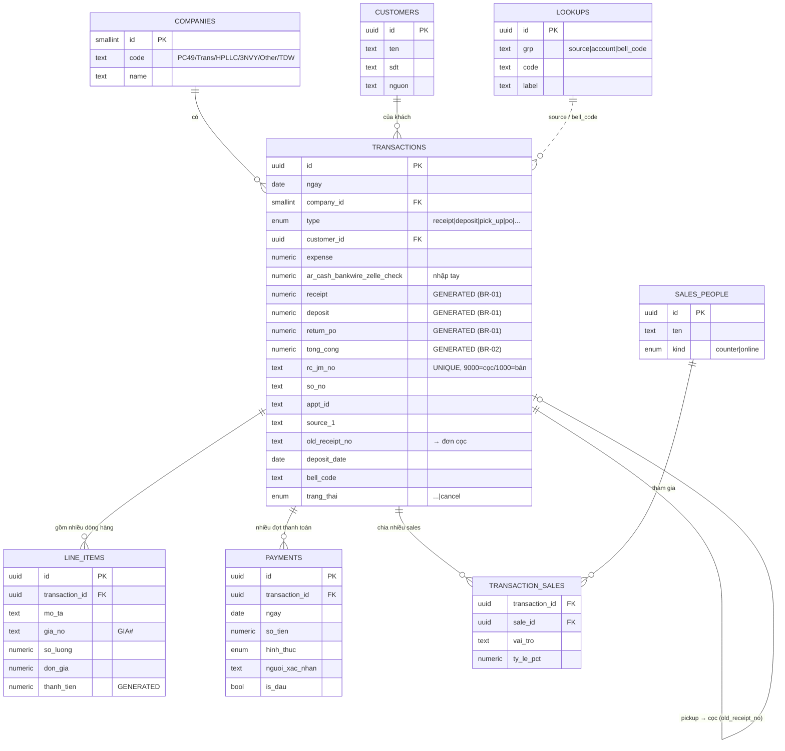

# ERD — Mô hình dữ liệu KTUS (Phân hệ 1)

Sơ đồ quan hệ (render trên GitHub/VS Code Mermaid). Chi tiết trường xem `schema.sql` & BRD §16.



## Ghi chú quan hệ
- **1 Giao dịch (RC) → nhiều Dòng hàng** (BR-07: nhập riêng, gộp & tự tính khi lưu).
- **1 Giao dịch → nhiều Thanh toán** (BR-06: đợt đầu lưu trên transaction + bảng payments; UI hiện "đợt đầu + chú thích").
- **1 Giao dịch → nhiều Sales** (junction `transaction_sales`, có `ty_le_pct`).
- **Pickup → Cọc:** `transactions.old_receipt_no` trỏ tới `rc_jm_no` của đơn cọc (1 cọc có thể nhiều pickup).
- **Trạng thái Cancel:** không xoá bản ghi (BR-10) — vẫn truy vấn theo `ngay` gốc.
- **CONDITION & TỔNG CỘNG** là cột generated trong DB — không cho ghi tay.

## Phase 1 — Khoá ngoại đã thêm (migration-phase1.sql)
Mục tiêu: dữ liệu nối nhau thay vì text rời. Cách làm: **thêm cột FK nullable + trigger tự nối** (app vẫn ghi text, DB tự điền FK).

| Bảng | Cột FK mới | Trỏ tới | Backfill |
|---|---|---|---|
| transactions | `company_id` | companies(code = upper(company)) | ✔ |
| transactions | `customer_id` | customers(ten = khach) — tự tạo khách | ✔ |
| transactions | `account_id` | accounts(name = company_account) — cash khớp; bank chung để null | ✔ một phần |
| transactions | `parent_id` | transactions(rc_jm_no = old_receipt_no) — pickup→cọc | ✔ |
| bank_statements | `account_id` | accounts(name = bank_account) | ✔ |
| accounts | `company_id` | companies(code = upper(entity)) | ✔ |

- **companies** = 12 thực thể: PC49, TRANS(=TFJ), TDW, HPLLC, 3NVY, OTHER, ADM, CL, AH, TL, TPM, TWT.
- **Trigger** `trg_link_tx`, `trg_link_bank` duy trì FK mỗi khi insert/update.
- Cột text cũ (`company`, `khach`, `company_account`, `old_receipt_no`…) **giữ nguyên** — Phase 3 sẽ chuyển đọc sang JOIN rồi mới gỡ.

## Phase 2/3 — Quan hệ đọc theo FK (migration-phase2-3.sql)
Mục tiêu: hoàn tất phần quan hệ mà vẫn giữ an toàn cho app đang chạy. Cách làm vẫn là **cộng thêm, backfill, trigger đồng bộ**, chưa xoá text legacy.

| Bảng | Cột/bảng quan hệ | Trỏ tới | Ghi chú |
|---|---|---|---|
| transactions | `source1_lookup_id`, `source2_lookup_id` | lookups(group=`source`) | Backfill từ `source_1/source_2`; app ưu tiên label từ lookup |
| transactions | `bell_code_lookup_id` | lookups(group=`bell_code`) | Backfill từ `bell_code`; report vẫn hiển thị mã RC1/RC2/RC3/SBO1 |
| transaction_sales | `transaction_id`, `sale_id`, `vai_tro`, `ty_le_pct` | transactions + sales_people | Backfill từ `sale_1` và `sale_online`; dùng cho nhiều sales + % |
| payments | `account_id` | accounts | Mặc định lấy theo `transactions.account_id` |
| bank_statements | `company_id`, `account_id` | companies + accounts | Chuẩn hoá công ty và tài khoản sao kê |
| company_aliases | `alias`, `company_id` | companies | Chuẩn hoá `Trans/TFJ` về `TRANS` |

- **Trigger** `trg_link_tx` nối company/customer/account/parent/source/bell mỗi khi insert/update.
- **Trigger** `trg_sync_tx_sales` đồng bộ `sale_1/sale_online` vào `transaction_sales`.
- **Trigger** `trg_link_payment` và `trg_link_bank` duy trì `account_id`.
- **View** `v_transactions_enriched` cho đọc join đầy đủ.
- **View** `v_account_movements` gom movement theo `account_id` để đối chiếu Balance ↔ transactions/bank.
- App ưu tiên FK (`account_id`, lookup, `transaction_sales`) và fallback text cũ nếu SQL chưa chạy.

Kiểm chứng nhanh sau khi chạy SQL:

```sql
select count(*) total, count(source1_lookup_id) co_source, count(bell_code_lookup_id) co_bell
from transactions;

select count(*) from transaction_sales;

select account_id, sum(amount)
from v_account_movements
group by account_id
order by 2 desc;
```
