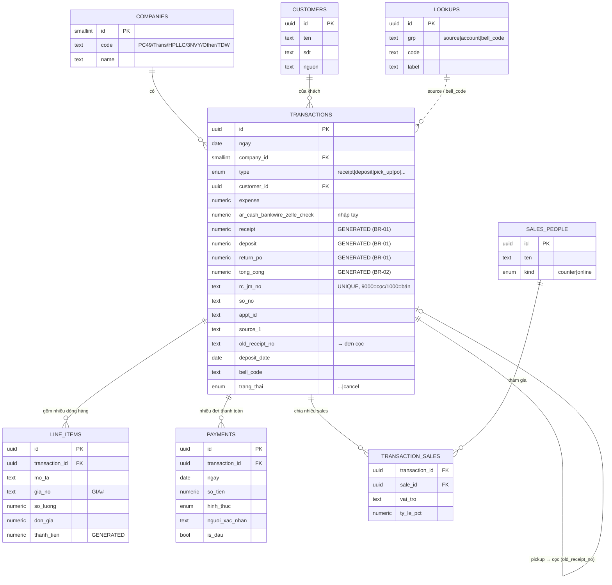

# ERD — Mô hình dữ liệu KTUS (Phân hệ 1)

Sơ đồ quan hệ (render trên GitHub/VS Code Mermaid). Chi tiết trường xem `schema.sql` & BRD §16.

## Ghi chú quan hệ
- **1 Giao dịch (RC) → nhiều Dòng hàng** (BR-07: nhập riêng, gộp & tự tính khi lưu).
- **1 Giao dịch → nhiều Thanh toán** (BR-06: đợt đầu lưu trên transaction + bảng payments; UI hiện "đợt đầu + chú thích").
- **1 Giao dịch → nhiều Sales** (junction `transaction_sales`, có `ty_le_pct`).
- **Pickup → Cọc:** `transactions.old_receipt_no` trỏ tới `rc_jm_no` của đơn cọc (1 cọc có thể nhiều pickup).
- **Trạng thái Cancel:** không xoá bản ghi (BR-10) — vẫn truy vấn theo `ngay` gốc.
- **CONDITION & TỔNG CỘNG** là cột generated trong DB — không cho ghi tay.

## Phase 1 — Khoá ngoại đã thêm (migration-phase1.sql)
Mục tiêu: dữ liệu nối nhau thay vì text rời. Cách làm: **thêm cột FK nullable + trigger tự nối** (app vẫn ghi text, DB tự điền FK).

| Bảng | Cột FK mới | Trỏ tới | Backfill |
|---|---|---|---|
| transactions | `company_id` | companies(code = upper(company)) | ✔ |
| transactions | `customer_id` | customers(ten = khach) — tự tạo khách | ✔ |
| transactions | `account_id` | accounts(name = company_account) — cash khớp; bank chung để null | ✔ một phần |
| transactions | `parent_id` | transactions(rc_jm_no = old_receipt_no) — pickup→cọc | ✔ |
| bank_statements | `account_id` | accounts(name = bank_account) | ✔ |
| accounts | `company_id` | companies(code = upper(entity)) | ✔ |

- **companies** = 12 thực thể: PC49, TRANS(=TFJ), TDW, HPLLC, 3NVY, OTHER, ADM, CL, AH, TL, TPM, TWT.
- **Trigger** `trg_link_tx`, `trg_link_bank` duy trì FK mỗi khi insert/update.
- Cột text cũ (`company`, `khach`, `company_account`, `old_receipt_no`…) **giữ nguyên** — Phase 3 sẽ chuyển đọc sang JOIN rồi mới gỡ.

## Phase 2/3 (sau)
- Junction `transaction_sales` (nhiều sales + %); chuyển source/bell_code sang `lookups`.
- Chuyển toàn bộ truy vấn/giao diện đọc theo FK; đối chiếu Balance ↔ transactions theo `account_id`; bỏ dần cột text.
