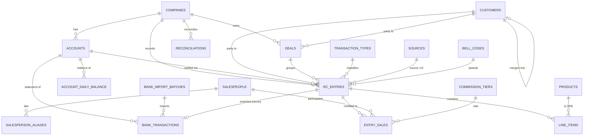

# KTUS System Redesign — Design Specification

**Project:** HPUS-KTUS-2026 · Số hóa nghiệp vụ Kế toán US (Excel/Google Sheets → Web app)
**Version:** 1.0 (full redesign based on updated source-of-truth process file)
**Date:** 2026-06-26
**Author (BA):** intern1@ctyhp.vn
**Status:** Draft — for user review
**Source of truth:** `QUY TRÌNH CÁC CV KTUS.xlsx` (updated 2026-06-26) + related Excel/Google Sheets workbooks

> **Scope decisions confirmed with user (2026-06-26):**
> 1. Module 1 (RC Tracking) + Module 2 (Cash & Bank) designed in full depth; Module 3 (Gold) outlined for future, with the schema built so it can be added without restructuring Modules 1–2.
> 2. Migrate existing 2026 Excel data (with customer dedup + broken-link repair).
> 3. The new system is the **operational source of truth** for RC/cash/bank tracking and produces the reports; it **reconciles to QuickBooks** balances but is **not** a full double-entry GL.
> 4. **Atomic RC entries grouped by a Deal**: each receipt (deposit, extra deposit, pickup, sale, return, cancel) is its own immutable ledger entry; a `deal` groups a multi-step customer transaction via a real foreign key.
> 5. Money stays **on `rc_entries`**, mirroring the sheet's A/R + A/P method columns (no separate payments table at this stage).
> 6. `deal_id` is **optional** for straight walk-in sales, **required** for any deposit / extra deposit / installment / pickup / return / cancel / multi-step transaction.

---

## Table of contents
1. Business analysis
2. Problems in the current design
3. Proposed system architecture
4. Database schema — tables & columns
5. Entity relationships (ERD)
6. Business rules (BR)
7. Business workflows
8. Data flow
9. Reporting logic
10. Reconciliation logic (Module 2)
11. Validation rules
12. Migration mapping
13. Feature list
14. UI workflow
15. Module 3 (Gold) — outline for future
16. Recommendations for overall architecture
17. Open questions & assumptions

---

## 1. Business analysis

### 1.1 The business
Hung Phat operates a multi-entity jewelry & gold business in the US, with accounting performed from Vietnam (KTUS — *Kế toán US*). Two channels are operationally active:

- **Trans** (Trans Fine Jewelry) — retail jewelry counter: deposits, pickups, sales, returns, exchanges, repairs. Customers often **deposit then pick up later** (a lifecycle that can span weeks-to-months and multiple payment installments).
- **PC49** (Pacific Four Nine) — **gold bullion & scrap** buy/sell: buys gold from customers (PO), sells bars by weight (VRP/lượng, oz), trades with Trans, sends scrap to assay.

Additional legal entities appear only on the cash/bank side: **TDW, HPLLC, 3NVY, Other** (ADM/AH/CL/TL/TWT/TPM). These hold bank accounts and expenses but little/no RC sales activity.

### 1.2 Daily work of the KT user (from the process file)
The process file defines three process areas:

- **I. Daily RC tracking** — receive scanned RC from US → enter into USBC101 → the same data feeds Sales Daily reports, RC JM logs (where JM receipt #, customer source, and salespeople are added), Sales Online, the Bell (Rung Chuông) bonus report, the Missing-Source QC log, and the daily cash reconciliation.
- **III. Cash book & bank statement** — check the US Cash Report, post cash changes into USBC101; download bank statements from Rocket, fix mis-mapped account numbers, split +/−, route per company into USBC101's bank block; reconcile KT vs US (QuickBooks) cash balances by date.
- **II. Daily gold management** *(future)* — gold inventory in/out/balance (NXT), COGS from A-Mark spot prices, scrap/assay (phân kim), deposit & pickup tracking, vendor AP, total assets, P&L.

### 1.3 Key reference data discovered in the source files

**Transaction types** (USBC101 `Data` sheet, with definitions):
Deposit, Extra deposit, Pick up, Receipt, Exchange, Trade in, Up grade, Return, Cancel, Memo (consignment), PO / PO (PC49), Ra RP (Grain→VRP gold transfer), Transfer (intercompany / gold conversion), Cash report (from US cash book), Store Credit, Repair.

**JM receipt numbering** (RC JM files): `9000…` = deposit, `1000…` = sale/pickup, `OC NHAP` = internal/purchase (no JM receipt), legacy formats `90014…` / `1000083…`.

**Customer source codes** (Nguồn KH): WI (walk-in), APPT, FB, TEL, RF (refer), RC (return customer), VIP, SOB, plus the marketing set (ANN, BB, GG, R-A-F, YP, TV, RADIO, PBN, HOLISALE, SUMMER, THNKSGV, NV, O-K, PR-GIFT, ONLINE1, REPAIR 50%, WK PR SALE, EBAY, HOME SHOP, WALK-IN), and `không có source` (missing).

**Bell / Ring (Rung Chuông) thresholds** (`6.2 … Quy định` sheet):

| Code | Scope | Value (USD) | Limit |
|---|---|---|---|
| RC1 | In-store (individual) | = 5,000 | once/day |
| RC2 | In-store (individual) | = 10,000 | once/day |
| RC3 | In-store (team) | = 50,000 | once/day |
| SBS1–SBS5 | Online, rung **in-store during hours** | 1k–9,999 / 10k–19,999 / 20k–29,999 / 30k–49,999 / ≥50k | no limit |
| SBO1–SBO5 | Online, rung **outside store / hours** | same five tiers | no limit |

Bell value = deposit amount for a deposit order, else total order value. A deal counts **once** (credited at the deposit stage; pickup duplicates are removed).

**Commission tiers ("Mức")** (RC JM `Data.` sheet):

| Tier | Position pct | | Tier | Position pct |
|---|---|---|---|---|
| A1 | 1.00 | | D1/D2/D3 | 0.60 / 0.20 / 0.20 |
| B1/B2 | 0.80 / 0.20 | | E1/E2/E3 | 0.50 / 0.25 / 0.25 |
| C1/C2 | 0.70 / 0.30 | | | |

Up to 3 in-store salespeople **and** up to 3 online sales reps per transaction. **Salesperson names differ by channel** — PC49 uses initials (`N.Ý`, `T.Quỳnh`, `L.Thanh`, `S.Mai`, `B.Khanh`); Trans uses full names (`Như Ý`, `Trúc Quỳnh`). These are the same people → alias mapping required.

**Gold taxonomy** (Module 3 reference): Rong Phung (RP, *lượng*), 9999 (*lượng*), Maple Leaf (ML, *oz*), Credit Suisse (CS, *oz*), American Eagle (AE, *oz*), Other (*oz*), Scrap Gold (*gram*, by karat 14/16-18/22/24k), PT (*gram*), Grain (*gram*). Conversions: 1 oz = 31.105 g; **1 lượng RP = 37.5 g**. SKU scheme = karat+form (`24KRI`, `18KBL`, `18KCH`, `18KER/PD`, diamonds `DIARI/LODIA/DRIMT` mounts, services `REPAIR/FINDING`).

**Chart of accounts** (USBC101 `BALANCE ACCOUNT` + `Validation List`): per-company accounts of type **Cash / Bank / CC-Loan**, e.g. `001 - TFJ BoA CK 9875`. Some flagged `Rocket không kết nối` (no auto bank feed).

---

## 2. Problems in the current design

| # | Problem | Evidence in source files | Consequence |
|---|---|---|---|
| P1 | **Duplicate data entry** | One transaction is re-keyed/copied across USBC101 → RC JM → Sales Daily → Online → Bell → Missing-source | Wasted effort, drift between copies |
| P2 | **Broken links (`#REF!`)** | `DEPOSIT DATE` (RC JM col AA) is `#REF!` on virtually every row; IMPORTRANGE chains break | Deposit↔pickup linkage unreliable today |
| P3 | **Two unrelated ledgers fused** | Company sheets put the RC/cash ledger (A–W) and bank statement (Y–AH) side by side though rows don't correspond | Confusing model, impossible to query cleanly |
| P4 | **No customer identity** | Customer matched by messy name + phone; manual "new vs existing" dedup; "missing phone" list | Can't reliably aggregate by customer; duplicates |
| P5 | **Payments float free** | cash/Zelle/CC logs hold only {date, amount, method} + a screenshot; reconciled by fuzzy match | No traceability from payment → RC → bank line |
| P6 | **Sheet/file sprawl** | New sheet per day, new file per month; layout drifts (missing-source status column moves K→L mid-year) | Maintenance burden, inconsistent structure |
| P7 | **Thin/incorrect prior schema** | Existing app models only A/R (drops A/P side needed by PO/Cash-report/Transfer), no bank entity, no chart-of-accounts/balances, no gold; bell codes hardcoded as `RC1/RC2/RC3/SBO1` (real set is RC1–3 + SBS1–5 + SBO1–5 with thresholds) | Reports can't be reproduced faithfully |
| P8 | **Weak relationships** | `old_receipt_no` is a free-text lookup, not an enforced FK; sources/types/tiers are loose strings | No referential integrity, no automation |

---

## 3. Proposed system architecture

**Stack (unchanged):** Next.js (App Router) + React + TypeScript · Supabase (PostgreSQL + Auth) · Drizzle ORM + drizzle-kit · Tailwind + shadcn/ui · react-hook-form + zod · TanStack Table/Query · date-fns · SheetJS (Excel export). Deploy: Vercel + Supabase.

**Principle: enter once, derive everywhere.** A transaction is captured a single time as an `rc_entry`. Sales Daily, RC JM, Sales Online, Bell, and Missing-Source are **read-only projections (SQL views / queries)** over `rc_entries` — never copies. This eliminates P1, P2, P3, P6 structurally.

**Four schema layers:**

```
SHARED MASTER ── companies, accounts, customers, salespeople, salesperson_aliases,
                 lookups, transaction_types, sources, bell_codes, commission_tiers,
                 payment_methods, bank_categories, audit_log
MODULE 1 (RC) ── rc_entries, deals, line_items, entry_sales
MODULE 2 (Cash/Bank) ── bank_transactions, bank_import_batches,
                 account_daily_balance, reconciliations
MODULE 3 (Gold, future) ── products, gold_types, inventory_movements, gold_prices
```

Module boundaries are enforced by FK direction: Module 2 references shared `accounts`/`companies` only; Module 1 references shared masters; Module 3 will reference `rc_entries`/`line_items` and shared masters **additively** (new tables + nullable FK columns), so Modules 1–2 never need restructuring (satisfies the user's expansion requirement).

---

## 4. Database schema — tables & columns

Conventions: PostgreSQL; snake_case; surrogate PKs (`uuid` default `gen_random_uuid()`, except small reference tables use `smallint`/`text` codes); money `numeric(14,2)` USD; gold weight `numeric(14,3)`; timestamps `timestamptz`. **Generated** = `GENERATED ALWAYS AS … STORED` (never hand-entered). All mutable business tables carry `created_at, updated_at, created_by, updated_by` and are audited (§6 BR-AUDIT).

### 4.1 Shared master

**`companies`**
| Column | Type | Notes |
|---|---|---|
| id | smallint PK identity | |
| code | text unique | Trans, PC49, TDW, HPLLC, 3NVY, Other |
| name | text | |
| active | boolean default true | |

**`accounts`** — chart of accounts (Cash/Bank/CC-Loan)
| Column | Type | Notes |
|---|---|---|
| id | uuid PK | |
| company_id | smallint FK→companies | |
| code | text | e.g. `001 - TFJ BoA CK 9875` |
| short_name | text | `Trans cash`, `Trans bank` (matches USBC101 "Company account") |
| account_no | text | full / last-4 (bank join key) |
| account_type | text | `cash` \| `bank` \| `cc_loan` |
| rocket_connected | boolean default true | false = `Rocket không kết nối` (manual) |
| beginning_balance | numeric(14,2) default 0 | opening balance for the period |
| active | boolean default true | |

**`customers`**
| Column | Type | Notes |
|---|---|---|
| id | uuid PK | stable surrogate (fixes P4) |
| name | text not null | display name |
| phone_raw | text | as entered |
| phone_normalized | text | 10-digit; **dedup key**, indexed |
| facebook | text | online channel handle |
| default_source_id | text FK→sources | |
| first_company_id | smallint FK→companies | where first seen |
| status | text | `new` \| `existing` (migration flag) |
| merged_into_id | uuid FK→customers | non-null if this record was merged away |
| note | text | |

> Uniqueness is **soft** (phone can be missing). A partial unique index on `phone_normalized` where not null + a dedup/merge UI handles P4; no hard constraint that would block legacy import.

**`salespeople`** & **`salesperson_aliases`**
| `salespeople` | Type | Notes |
|---|---|---|
| id | uuid PK | |
| name | text | canonical full name |
| kind | text | `counter` \| `online` \| `manager` |
| active | boolean | |

| `salesperson_aliases` | Type | Notes |
|---|---|---|
| id | uuid PK | |
| salesperson_id | uuid FK→salespeople | |
| alias | text | e.g. `N.Ý`, `Như Ý`, `Trúc Quỳnh`, `T.Quỳnh` |
| unique(alias) | | resolves PC49-initials vs Trans-fullname |

**`lookups`** — generic small dropdowns (payment methods, bank categories, gold types in M3): `id, grp, code, label, sort, active, unique(grp,code)`.

**`sources`** — customer source codes: `code PK (text), label, channel (online|in_store|marketing), active`.

**`transaction_types`** — drives CONDITION & direction (replaces enum):
| Column | Type | Notes |
|---|---|---|
| code | text PK | `deposit`, `extra_deposit`, `pick_up`, `receipt`, `exchange`, `trade_in`, `up_grade`, `return`, `cancel`, `memo`, `po`, `ra_rp`, `transfer`, `cash_report`, `store_credit`, `repair` |
| label | text | display + Excel label |
| condition_bucket | text | `receipt` \| `deposit` \| `return_po` \| `none` (BR-01) |
| money_direction | text | `in` \| `out` \| `none` |
| requires_source | boolean | true for sale/deposit/pickup types (drives Missing-Source) |
| requires_deal | boolean | true for deposit/extra_deposit/pick_up/return/cancel/exchange/up_grade |
| definition | text | the Vietnamese definition from USBC101 `Data` |

**`bell_codes`**
| Column | Type | Notes |
|---|---|---|
| code | text PK | RC1–RC3, SBS1–SBS5, SBO1–SBO5 |
| scope | text | `in_store` \| `online_in` \| `online_out` |
| min_value | numeric(14,2) | tier floor (null for fixed RC) |
| max_value | numeric(14,2) | tier ceiling (null = open) |
| fixed_value | numeric(14,2) | for RC1=5000/RC2=10000/RC3=50000 |
| per_day_limit | int | 1 for RC1–3, null = unlimited |
| is_team | boolean | true for RC3 |

**`commission_tiers`**: `code PK (A1,B1,…), position int, pct numeric(5,4)`.

**`audit_log`**: `id bigserial PK, table_name, record_id, action (INSERT/UPDATE/DELETE/IMPORT/RECONCILE), changed_by, changed_at, diff jsonb`.

### 4.2 Module 1 — RC tracking

**`deals`** — groups a multi-step customer transaction (deposit→…→pickup)
| Column | Type | Notes |
|---|---|---|
| id | uuid PK | |
| company_id | smallint FK→companies | |
| customer_id | uuid FK→customers | |
| opened_date | date | = first deposit date (**reliable** replacement for broken `DEPOSIT DATE`) |
| deal_value | numeric(14,2) | agreed total (editable) |
| status | text | `open` \| `collecting` \| `ready` \| `completed` \| `cancelled` \| `returned` |
| anchor_entry_id | uuid FK→rc_entries | the originating deposit entry |
| note | text | |
| *audit cols* | | |

**`rc_entries`** — the atomic ledger fact (one USBC101 / RC-JM row)
| Column | Type | Notes |
|---|---|---|
| id | uuid PK | |
| company_id | smallint FK→companies | |
| account_id | uuid FK→accounts | "Company account" (Trans cash/bank); nullable |
| deal_id | uuid FK→deals | **required** when `transaction_types.requires_deal`; else optional (BR-DEAL) |
| entry_date | date not null | **original transaction date — never auto-changed** (BR-10) |
| type_code | text FK→transaction_types | |
| description | text | USBC101 `Decription` / RC JM `DECRIPTION` |
| customer_id | uuid FK→customers | nullable |
| contact_raw | text | phone as written on the entry (migration; canonical lives on customer) |
| sku_raw | text | comma-separated SKU string (parsed into line_items) |
| bell_code | text FK→bell_codes | nullable (col G / col E "Rung Chuông") |
| — **Money (mirrors the sheet, BR-MONEY)** — | | |
| expense | numeric(14,2) default 0 | EXPENSE / Purchase / Trade-in (PO/return/trade) |
| ar_cash, ar_bankwire, ar_zelle, ar_check, ar_received | numeric(14,2) default 0 | A/R (+) by method; `ar_received` = previously-collected deposit applied at pickup |
| ap_cash, ap_bankwire, ap_zelle, ap_check | numeric(14,2) default 0 | A/P (−) by method |
| receipt | numeric(14,2) **generated** | = (ar sum) when `condition_bucket='receipt'` else 0 |
| deposit | numeric(14,2) **generated** | = (ar sum) when `condition_bucket='deposit'` else 0 |
| return_po | numeric(14,2) **generated** | = `expense` when `condition_bucket='return_po'` else 0 |
| total | numeric(14,2) **generated** | = receipt + deposit − return_po (BR-02) |
| — **JM step-2 fields** — | | |
| jm_receipt_no | text | col J / H; nullable until step 2 |
| jm_kind | text **generated** | `deposit` if starts `9000`/`900`; `sale_pickup` if `1000`; `oc_nhap` if `OC NHAP`; else `other` |
| source1_id | text FK→sources | |
| source2_id | text FK→sources | |
| transaction_value | text | RC JM col X (e.g. "1 lượng", or $ value) |
| pct_support | numeric(5,4) | online support % |
| old_receipt_no | text | raw pickup→deposit pointer (migration); resolves to `deal_id` |
| note | text | |
| *audit cols* | | |

Indexes: `(company_id, entry_date)`, `(entry_date)`, `(deal_id)`, `(customer_id)`, `(jm_receipt_no)`, `(type_code)`, partial index for missing-source (`source1_id is null` and type requires source).

**`line_items`** — "1 RC, many products" + the RC JM AE/AF/AG breakdown
| Column | Type | Notes |
|---|---|---|
| id | uuid PK | |
| rc_entry_id | uuid FK→rc_entries ON DELETE CASCADE | |
| line_no | int | order within entry |
| description | text | |
| sku | text | single SKU (e.g. `24KRI`) |
| gia_no | text | GIA # (diamonds) |
| product_id | uuid FK→products | **Module 3, nullable now** |
| gold_type_code | text FK→lookups(gold_type) | **Module 3, nullable now** |
| qty | numeric(14,3) | |
| unit | text | pcs / lượng / oz / gram |
| unit_price | numeric(14,2) | |
| amount | numeric(14,2) **generated** | = coalesce(qty,0)*coalesce(unit_price,0) |

**`entry_sales`** — commission split (counter + online), one row per participant
| Column | Type | Notes |
|---|---|---|
| id | uuid PK | |
| rc_entry_id | uuid FK→rc_entries ON DELETE CASCADE | |
| salesperson_id | uuid FK→salespeople | resolved via aliases on import |
| channel | text | `counter` \| `online` |
| position | smallint | 1 / 2 / 3 |
| tier_code | text FK→commission_tiers | e.g. B1 (counter only) |
| pct | numeric(5,4) | credit share |
| unique(rc_entry_id, channel, position) | | |

### 4.3 Module 2 — Cash & Bank

**`bank_import_batches`**: `id uuid PK, imported_at timestamptz, source text ('rocket'), file_name text, row_count int, imported_by uuid, note text`.

**`bank_transactions`** — bank statement lines (separate from RC; link only via reconciliation)
| Column | Type | Notes |
|---|---|---|
| id | uuid PK | |
| account_id | uuid FK→accounts | resolved from raw account no via MATCHING |
| company_id | smallint FK→companies | |
| txn_date | date | |
| original_date | date | Rocket "Original Date" |
| description | text | |
| category | text FK→lookups(bank_category) | |
| payee | text | |
| conf_no | text | Zelle Conf# / reference parsed from description |
| amount_in | numeric(14,2) default 0 | BANK (+) |
| amount_out | numeric(14,2) default 0 | BANK (−) |
| raw_account_no | text | as exported (for re-mapping) |
| import_batch_id | uuid FK→bank_import_batches | |
| reconciled | boolean default false | |
| matched_rc_entry_id | uuid FK→rc_entries | **soft** link, nullable (reconciliation only) |
| note | text | |

**`account_daily_balance`** — snapshot for fast balance/reconciliation (mirrors `BALANCE ACCOUNT`)
| Column | Type | Notes |
|---|---|---|
| account_id | uuid FK→accounts | |
| balance_date | date | |
| beginning | numeric(14,2) | |
| ending | numeric(14,2) | computed: beginning + cash movements + bank movements |
| pk(account_id, balance_date) | | |

> `ending` is normally **derived** by a nightly/refresh job (or a SQL view) from `rc_entries` cash amounts + `bank_transactions`; the table is a materialized snapshot so reconciliation and the balance report are O(1). A view `v_account_balance` provides the live version.

**`reconciliations`** — KT vs US (QuickBooks), the `US-BC SỔ CASH` equivalent
| Column | Type | Notes |
|---|---|---|
| id | uuid PK | |
| company_id | smallint FK→companies | |
| account_id | uuid FK→accounts | nullable (company-level or account-level) |
| recon_date | date | |
| kt_balance | numeric(14,2) | from `account_daily_balance` / system |
| us_balance | numeric(14,2) | entered from QuickBooks/US cash report |
| difference | numeric(14,2) **generated** | = kt_balance − us_balance |
| reason | text | explanation when difference ≠ 0 |
| status | text | `matched` \| `pending` \| `explained` |
| *audit cols* | | |

### 4.4 Module 3 — Gold (outline only; created in a later phase)
`products` (sku PK, form, default_gold_type, karat), `gold_types` (code, unit, conversion_to_gram), `inventory_movements` (gold_type, qty signed, type=PO/Sale/Pickup/Transfer/RaRP, source rc_entry_id, balance), `gold_prices` (date, gold_type, cogs, spot_source). These attach to Module 1 via `line_items.product_id`/`gold_type_code` (already present as nullable FKs) — **no change to Modules 1–2 when added.**

---

## 5. Entity relationships (ERD)



Relationship summary:
- **1 deal → many rc_entries** (deposit, extra deposits, pickup, cancel). 1 walk-in receipt may have **no deal**.
- **1 rc_entry → many line_items** (multi-product) and **many entry_sales** (≤3 counter + ≤3 online).
- **bank_transactions are independent**; they connect to RC only through the optional `matched_rc_entry_id` during reconciliation (never a hard dependency).
- **customers/salespeople/sources/types/bell_codes/tiers** are shared masters referenced read-only by entries.

---

## 6. Business rules (BR)

| ID | Rule |
|---|---|
| **BR-01 CONDITION** | `receipt`/`deposit`/`return_po` are generated from `transaction_types.condition_bucket` × the relevant money sum. Receipt-bucket: receipt = Σ A/R methods. Deposit-bucket: deposit = Σ A/R methods. Return/PO-bucket: return_po = expense. `none` → all zero. Never hand-entered. |
| **BR-02 TOTAL** | `total` = receipt + deposit − return_po (generated). |
| **BR-MONEY** | Each entry stores A/R-by-method (cash/bankwire/zelle/check/received) and A/P-by-method (cash/bankwire/zelle/check). `ar_received` = prior deposit applied at pickup. |
| **BR-DEAL** | `deal_id` is **required** when the type's `requires_deal` = true (deposit, extra_deposit, pick_up, return, cancel, exchange, up_grade); **optional** for straight `receipt`/`repair` walk-ins. |
| **BR-DEAL-DATE** | `deal.opened_date` = the anchor deposit's `entry_date` (replaces broken `DEPOSIT DATE`). Pickup entries read this; it is never `#REF!`. |
| **BR-DEAL-BALANCE** | collected = Σ over deal's entries of (receipt+deposit cash collected, excluding `ar_received`); remaining = deal_value − collected. Pickup allowed when remaining ≤ 0 (or per user override). |
| **BR-LIFECYCLE** | Deal status: open → collecting → ready → completed (on pickup) ; or → cancelled / returned. **Cancel/Return create new entries**; original entries keep their original `entry_date` (BR-10). |
| **BR-05 JM#** | `jm_kind` derived: `9000…`=deposit, `1000…`=sale/pickup, `OC NHAP`=internal. Warn (not block) on duplicate `jm_receipt_no` within company+period; `OC NHAP` and blanks are exempt from uniqueness. |
| **BR-SOURCE** | If `transaction_types.requires_source` and `source1_id` is null/`không có source`, the entry appears in **Missing-Source** with a `reason`; cleared when source is set (replaces the K/L-drift QC file). |
| **BR-BELL** | The system **suggests** a bell_code from order value × scope using `bell_codes` thresholds; KT confirms. RC1–3 limited once/day/company. A **deal is bell-counted once** (at deposit); pickup duplicates excluded from the Bell report. |
| **BR-COMMISSION** | Per channel, Σ `entry_sales.pct` should = 1.00; tiers default the pct (A1=1.0, B1/B2=.8/.2, …). Warn if sum ≠ 1.00. |
| **BR-09 Promo** | Promotions (refer-a-friend / discounts) recorded as a line_item reduction or a note; do not break totals. |
| **BR-BANK-SEP** | Bank transactions never share a row with RC entries; reconciliation links are soft and optional. |
| **BR-RECON** | `reconciliations.difference` = kt_balance − us_balance (generated); non-zero requires a `reason`. |
| **BR-AUDIT** | Every INSERT/UPDATE/DELETE on business tables, plus every bank IMPORT and RECONCILE action, writes `audit_log` with actor + jsonb diff. |
| **BR-DATE-IMMUTABLE** | `rc_entries.entry_date` and `deals.opened_date` are preserved on edits; status changes never move an entry to a new date (filters by date always show the entry at its original date). |

---

## 7. Business workflows

**W1 — Enter a daily RC (2-step, one record):**
1. *Step 1 (from US scan):* choose Company → Type → Customer (search/create) → add line items (desc, SKU, qty, price) → enter money by method (A/R or A/P) → Save. System computes CONDITION, total; if type requires a deal, link/create the deal.
2. *Step 2 (from JM):* reopen the same entry → enter JM receipt #, Source 1/2, counter & online salespeople + tiers, transaction value, % support → Save. Source filled → leaves Missing-Source; bell suggested.

**W2 — Deposit → installments → pickup:**
Deposit entry creates a **deal** (status open). Extra-deposit entries reference the deal (collecting). At pickup, a Pick-up entry references the deal; `ar_received` carries the prior deposits; remaining computed; deal → completed. The original deposit entry stays at its original date.

**W3 — Cancel / Return:** a Cancel/Return entry is added to the deal; deal status → cancelled/returned; nothing is deleted; original dates preserved.

**W4 — Bank import (Module 2):** upload Rocket export → create `bank_import_batch` → map raw account no → `accounts` (MATCHING; warn on unmapped) → split signed amount into in/out → assign company → store as `bank_transactions`. Manual account-no corrections logged.

**W5 — Reconciliation (Module 2):** for a date/company, system shows KT balance (from `account_daily_balance`); KT enters US (QuickBooks) balance; difference computed; KT records a reason if non-zero; status set.

**W6 — Missing-Source loop:** Missing-Source queue lists entries lacking source with a reason. KT sends to US → US supplies source → KT updates entry → it leaves the queue (status tracked, audited).

---

## 8. Data flow

```
                      ┌─────────────────────────────────────────────┐
  US scan / JM ─────▶ │  rc_entries  (single capture, 2 steps)       │
                      │   + deals + line_items + entry_sales         │
                      └───────────────┬─────────────────────────────┘
                                      │ (SQL views / queries — NO copies)
        ┌───────────────┬─────────────┼───────────────┬───────────────┐
        ▼               ▼             ▼               ▼               ▼
  Sales Daily      RC JM view     Sales Online      Bell report   Missing-Source
  (per day/co)     (JM/source/    (online entries)  (per deal,    (no source, reason)
                    sales)                            dedup once)
                      ┌─────────────────────────────────────────────┐
 Rocket export ────▶ │  bank_transactions (import pipeline)          │──▶ account_daily_balance
                      └───────────────┬─────────────────────────────┘            │
                                      ▼                                           ▼
                              reconciliation (KT vs QuickBooks)  ◀───────────────┘
```

No IMPORTRANGE; no per-day/per-month sheet creation; reports are date-filtered queries.

---

## 9. Reporting logic

All reports are **queries over `rc_entries`** (+ joins), filterable by company/date/period, exportable to Excel (SheetJS) with **the exact legacy column names & order** for parity.

- **R1 Sales Daily (PC49 / Trans):** columns `STT · TYPE · DISCRIPTION · CUSTOMER · TỔNG CỘNG · PURCHASE/PO · RECEIPT(Bán ra)[Trans: TOTAL RECEIPT] · DEPOSIT · [THU TIỀN] CASH·BANKWIRE·ZELLE·CHECK·RECEIVED · [CHI TIỀN] CASH·BANKWIRE·ZELLE·CHECK · COMPANY`. Filter: company + date (each day a section) or period. Source: `rc_entries` where company & date.
- **R2 RC JM (PC49 / Trans):** the entry list with JM#, source 1/2, counter & online sales + tiers, transaction value, old receipt #, deposit date (from `deal.opened_date`). Filter: company + month.
- **R3 Sales Online:** entries having ≥1 online salesperson — `NO · DATE · CUST. NAME · FACEBOOK · DECRIPTION · JM DEPOSIT# · JM RECEIPT# · SALE US · Sale Onl #1/2/3 · % SUPPORT · TRANSACTION VALUE · LƯỢNG · CHECK`. The `-KT` reconciled variant = same view with a `checked` flag.
- **R4 Bell (Rung Chuông):** scoreboard (count of qualifying deals per bell_code) + detail; **counts each deal once** (BR-BELL), with duplicate (deposit↔pickup) suppression built into the query rather than manual row deletion.
- **R5 Missing-Source:** entries where source missing + reason + resolved flag (single consistent layout, fixing the K/L drift).
- **R6 Account balance / cash book (Module 2):** per-account daily beginning/ending; cash book per company.

---

## 10. Reconciliation logic (Module 2)

1. **Bank ingest:** Rocket export → normalize → map last-4 `raw_account_no` → `accounts.account_no`. Unmapped/blank account numbers (e.g. 4500, 0602) are flagged for manual mapping (logged). Signed amount → `amount_in`/`amount_out`.
2. **Balance build:** `account_daily_balance.ending` = `beginning` + Σ cash-side RC movements (for cash accounts) + Σ (`amount_in` − `amount_out`) bank lines (for bank accounts), per date.
3. **KT vs US:** `reconciliations` stores KT balance (system) and US balance (QuickBooks/US cash report) per date/company/account; `difference` generated; KT records `reason` when non-zero; status `matched`/`pending`/`explained`.
4. **Optional RC↔bank matching:** suggest candidate `bank_transactions` for an `rc_entry` (or vice-versa) by {date ± window, amount, method/Conf#}; KT confirms → sets `matched_rc_entry_id` + `reconciled=true`. Always soft (BR-BANK-SEP).

---

## 11. Validation rules

- Required on save (Step 1): company, type, entry_date, at least one of {customer, description}, and money consistent with type direction.
- Money ≥ 0; A/R used only for `in` types, A/P only for `out` types (warn otherwise).
- `entry_date` valid, not in the future (except scheduled pickup).
- `requires_deal` types must have a `deal_id` (BR-DEAL); pickup must resolve `old_receipt_no` to an existing deposit deal (warn if unresolved).
- Duplicate `jm_receipt_no` (same company/period) → warn (BR-05); `OC NHAP`/blank exempt.
- Commission pct per channel ≠ 1.00 → warn (BR-COMMISSION).
- Setting deal status `completed` while source missing → prompt to fill source.
- Bank import: every row must map to an account or be quarantined; reconciliation difference ≠ 0 requires a reason before `explained`.

---

## 12. Migration mapping (2026 data)

| Source | → Target | Notes |
|---|---|---|
| USBC101 `Validation List` / `BALANCE ACCOUNT` | `companies`, `accounts` (+ beginning_balance, rocket_connected) | account types Cash/Bank/CC-Loan |
| USBC101 `Data` sheet | `transaction_types` (with definitions), `sources`, `lookups` | seed reference data |
| `6.2 … Quy định` | `bell_codes` (thresholds), `commission_tiers` | from the rules sheet |
| THÔNG TIN KHÁCH HÀNG | `customers` | **dedup by `phone_normalized`**; carry `status`; build `salesperson_aliases` |
| USBC101 company sheets (cols A–W) | `rc_entries` (+ `line_items` from SKU/desc parse) | one sheet row → one entry; A/R & A/P columns map 1:1 |
| RC JM files (5/6) | enrich matched `rc_entries` with JM#, source1/2, sales+tiers, transaction value | match by company+date+description+amount; create `entry_sales` (resolve aliases) |
| RC JM `Old Receipt #` + deposit rows | `deals` + `rc_entries.deal_id` | **repair the broken deposit↔pickup links** into real FKs; set `deal.opened_date` |
| USBC101 company sheets (cols Y–AH) + Rocket | `bank_transactions` (+ `bank_import_batches`) | separated from RC |
| Receipts (cash/Zelle/CC) logs | informational only at this stage | reconcile by {date,amount,method}; not imported as FKs (P5 noted, future) |

**Post-migration reconciliation:** totals per company/period (receipt/deposit/PO, cash balances) must match the legacy files; discrepancies logged. Customer dedup report produced for KT review.

---

## 13. Feature list (MoSCoW — M=Must for Phase 1)

**Module 1 — RC tracking**
- M: 2-step single-record RC entry; multi-line items; CONDITION/total auto-calc; deal grouping with reliable deposit date; deposit→installment→pickup; cancel/return preserving dates; JM/source/sales step-2; commission split with tiers; bell suggestion + confirm; Missing-Source queue & loop; customer search/create/dedup; salesperson alias resolution.
- M: Reports R1–R5 with Excel export at legacy column parity.
- S: customer merge UI; duplicate-JM and commission-sum warnings; dashboard (today's KPIs, to-do).
- C: attach RC scan image (deferred).

**Module 2 — Cash & Bank**
- M: Rocket bank import pipeline (map/split/route); account chart & daily balances; reconciliation (KT vs QB) with reason logging; cash book / balance report.
- S: RC↔bank match suggestions; import quarantine for unmapped accounts.

**Shared**
- M: auth (single KT user, RLS ready for multi-user); audit log for edits/deletes/imports/reconciliations; lookups/master-data management.
- S: role-based permissions (future-ready).

**Module 3 — Gold:** outlined only (no Phase-1 build).

---

## 14. UI workflow (screens)

| Screen | Purpose |
|---|---|
| Dashboard | Today's KPIs, Missing-Source count, recent entries, reconciliation status |
| RC Entry (create/edit) | 2-step form; line items; money by method; deal link; step-2 JM/source/sales; bell |
| RC Ledger | Searchable/filterable list of `rc_entries` (company, date, type, status, source, deal) |
| Deal detail | Entries in the deal, collected/remaining, lifecycle status, deposit↔pickup, sales split |
| Reports: Sales Daily / RC JM / Sales Online / Bell / Missing-Source | Filtered views + Excel export |
| Bank import | Upload, mapping review, quarantine, batch history |
| Reconciliation | Per date/company: KT vs US balance, difference, reason |
| Customers / Salespeople / Catalog (lookups) | Master-data management, dedup/merge, alias mapping |
| Audit log | Embedded in ledger/deal + a global view |

List-first navigation; status colors; copy and column names match the KT user's existing habits to ease adoption.

---

## 15. Module 3 (Gold) — outline for future

Adds `products`, `gold_types` (unit + gram conversion: 1 lượng RP = 37.5 g, 1 oz = 31.105 g), `inventory_movements` (driven from `line_items` of PO/Sale/Pickup/Transfer/Ra-RP entries), and `gold_prices` (daily COGS from A-Mark spot). Connects via the **already-present nullable** `line_items.product_id` / `gold_type_code`. Enables NXT (in/out/balance), scrap/assay, COGS, and P&L without touching Modules 1–2.

---

## 16. Recommendations for overall architecture

1. **Single Postgres database, modular schema** with additive Module 3 — no IMPORTRANGE, no cross-file links.
2. **Generated columns** for CONDITION/total/difference keep computed values correct and un-editable.
3. **Reference tables (types, sources, bell, tiers)** instead of hardcoded strings → automation + integrity (fixes P7/P8).
4. **Reports as views**, exported with legacy column names for parity and trust during parallel-run.
5. **Soft bank↔RC linkage** keeps the two ledgers cleanly separated yet reconcilable (fixes P3/P5).
6. **Audit everything**; RLS enabled now (full access for the single KT user) so multi-user is a policy change, not a refactor.
7. **Parallel run** one period against the Excel files before cutover; reconcile totals.
8. **Phase plan:** P1 = Module 1 + master data + reports; P2 = Module 2 (bank/recon); P3 = Module 3 (gold).

---

## 17. Open questions & assumptions

**Assumptions:** single KT user in Phase 1 (RLS multi-user-ready); currency USD; all six companies in scope but only Trans & PC49 have active RC entries; QuickBooks remains the US books (we reconcile, not replace); RC scan attachments deferred.

**Open questions to confirm during build:**
1. Is `jm_receipt_no` ever truly globally unique, or only within company+period? (We treat as warn-only.)
2. Exact deal-completion rule when remaining ≤ 0 vs. manager override — confirm tolerance.
3. Bonus/commission **payout** computation (amount in VNĐ by deal-size tiers) — in scope for Phase 1 or report-only?
4. Should `account_daily_balance` be a materialized snapshot (nightly) or a live view? (Default: snapshot + live view.)
5. Migration start period — full 2026 from January, or from a chosen cutover month?
6. Receipts (cash/Zelle/CC) screenshot logs — keep as external archive, or plan structured payment capture in a later phase (P5)?
